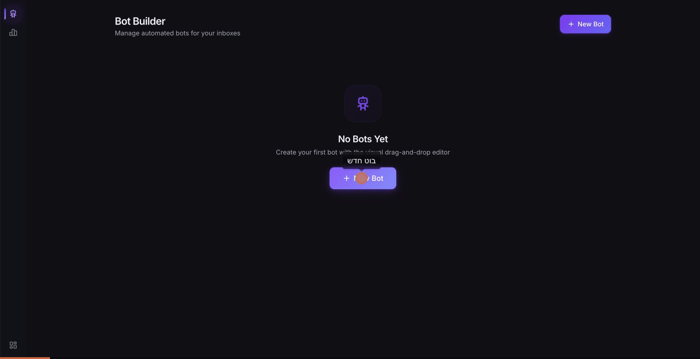
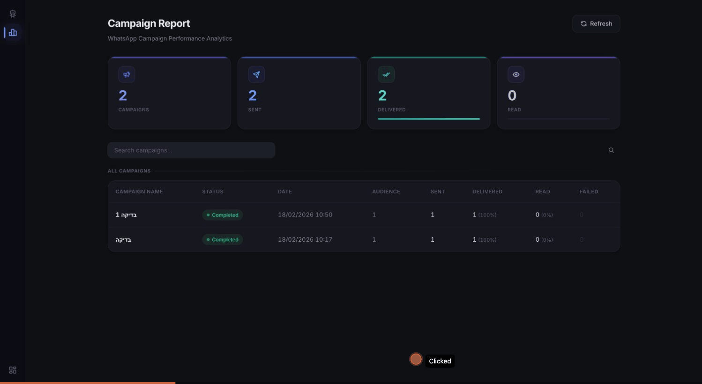

<p align="center">
  
  <br><br>
  <strong>Visual Bot Builder + Campaign Analytics for Chatwoot</strong>
  <br>
  Drop-in Rack middleware extensions — no core modifications needed
  <br><br>
  <a href="#-quick-start"></a>
  <a href="#-features"></a>
  <a href="https://github.com/achiya-automation/chatwoot-addons/blob/main/LICENSE"></a>
  <a href="https://www.chatwoot.com/"></a>
</p>

---

## What is this?

**Chatwoot Addons** adds two powerful tools to your self-hosted Chatwoot instance — without touching Chatwoot's source code:

1. **Bot Builder** — A visual drag-and-drop bot flow editor (think ManyChat/Botpress, inside Chatwoot)
2. **Campaign Report** — WhatsApp campaign analytics dashboard with delivery tracking and CSV export

Both are injected as Rack middleware via Docker volume mounts. They run alongside Chatwoot and use its authentication, database, and session management.

## 📸 Screenshots

### Bot Builder — Visual Flow Editor
<p align="center">
  
</p>

### Campaign Report — Analytics Dashboard
<p align="center">
  
</p>

## ✨ Features

### Bot Builder (`/bot-builder`)

- **Visual drag & drop editor** powered by [Drawflow.js](https://github.com/jerosoler/Drawflow)
- **18 node types**: triggers, messages, images, videos, buttons, menus, conditions, delays, assignments, labels, attributes, webhooks, notes, priorities, statuses, inbox transfers, wait-for-reply, go-to-step
- **Bot execution engine** — bots actually run on incoming messages via `Message.after_commit`
- **Flow validation** with error highlighting
- **Undo/Redo** (Ctrl+Z / Ctrl+Shift+Z, 30-step stack)
- **Auto-align** (BFS layer-based using Dagre)
- **Snap-to-grid** (24px, toggleable)
- **Minimap** with click-to-pan
- **Import/Export** flows as JSON
- **Context menu** (right-click nodes)
- **Keyboard shortcuts**: Ctrl+S save, Del delete, Ctrl+D duplicate
- **Dark mode** — auto-detects Chatwoot theme
- **JSON file storage** — no database migrations needed
- **Multi-inbox support** — assign bots to specific inboxes

### Campaign Report (`/campaign-report`)

- **Campaign list** with KPI cards (sent, delivered, read, failed)
- **Campaign detail** with delivery funnel visualization
- **Per-contact delivery status** tracking
- **CSV export** with full contact details
- **Search & sort** across campaigns
- **Status badges** (completed, active, scheduled)
- **Dark mode** — consistent with Bot Builder theme

### Navigation Widget

- **Slide-out sidebar** accessible from all Chatwoot pages (hover left edge)
- Links to Bot Builder, Campaign Report, and Chatwoot dashboard
- Auto-injected into every Chatwoot HTML page

## 🚀 Quick Start

### Prerequisites

- Self-hosted Chatwoot running with Docker
- SSH access to your server

### Installation

```bash
# Clone the repo
git clone https://github.com/achiya-automation/chatwoot-addons.git
cd chatwoot-addons

# Run the installer (interactive)
sudo bash install.sh

# Or non-interactive (auto-approve all prompts)
sudo bash install.sh --yes
```

The installer will:
1. Detect your Chatwoot Docker containers
2. Copy addon files to the custom initializers directory
3. Optionally patch your `docker-compose.yaml`/`docker-compose.yml` with volume mounts
4. Check for CSP (Content Security Policy) issues and show fix instructions
5. Restart Chatwoot

### Manual Installation

If you prefer manual setup:

**1. Copy files to your server:**

```bash
mkdir -p /opt/chatwoot/custom-initializers

# Copy the three .rb files
cp initializers/bot_builder.rb /opt/chatwoot/custom-initializers/
cp initializers/campaign_report_dashboard.rb /opt/chatwoot/custom-initializers/
cp initializers/custom_nav_widget.rb /opt/chatwoot/custom-initializers/
```

**2. Add volume mounts** to your `docker-compose.yaml` (or `docker-compose.yml`) for the `rails`, `sidekiq`, and `worker` services:

```yaml
volumes:
  - /opt/chatwoot/custom-initializers/bot_builder.rb:/app/config/initializers/bot_builder.rb:ro
  - /opt/chatwoot/custom-initializers/campaign_report_dashboard.rb:/app/config/initializers/campaign_report_dashboard.rb:ro
  - /opt/chatwoot/custom-initializers/custom_nav_widget.rb:/app/config/initializers/custom_nav_widget.rb:ro
```

**3. Restart Chatwoot:**

```bash
docker compose restart
```

**4. Access your addons:**

- Bot Builder: `https://your-chatwoot.com/bot-builder`
- Campaign Report: `https://your-chatwoot.com/campaign-report`

Both require a logged-in Chatwoot session.

### ⚠️ Content Security Policy (CSP)

If your reverse proxy (Nginx, Caddy, Apache) sets a `Content-Security-Policy` header, you **must** allow the CDN domains used by the addons. Without this, the Bot Builder editor will not load.

Add these domains to your CSP header:

| Directive | Add these domains |
|-----------|-------------------|
| `script-src` | `https://cdn.jsdelivr.net https://unpkg.com` |
| `style-src` | `https://cdn.jsdelivr.net https://unpkg.com https://fonts.googleapis.com` |

<details>
<summary><strong>Caddy example</strong></summary>

```
header {
    Content-Security-Policy "default-src 'self'; script-src 'self' 'unsafe-inline' 'unsafe-eval' https://cdn.jsdelivr.net https://unpkg.com; style-src 'self' 'unsafe-inline' https://cdn.jsdelivr.net https://unpkg.com https://fonts.googleapis.com; img-src 'self' data: blob: https:; font-src 'self' data: https:; connect-src 'self' wss: https:; frame-ancestors 'self'"
}
```

After editing, reload Caddy: `sudo systemctl reload caddy`

</details>

<details>
<summary><strong>Nginx example</strong></summary>

```nginx
add_header Content-Security-Policy "default-src 'self'; script-src 'self' 'unsafe-inline' 'unsafe-eval' https://cdn.jsdelivr.net https://unpkg.com; style-src 'self' 'unsafe-inline' https://cdn.jsdelivr.net https://unpkg.com https://fonts.googleapis.com; img-src 'self' data: blob: https:; font-src 'self' data: https:; connect-src 'self' wss: https:; frame-ancestors 'self'" always;
```

After editing, reload Nginx: `sudo nginx -t && sudo systemctl reload nginx`

</details>

<details>
<summary><strong>Apache example</strong></summary>

```apache
Header set Content-Security-Policy "default-src 'self'; script-src 'self' 'unsafe-inline' 'unsafe-eval' https://cdn.jsdelivr.net https://unpkg.com; style-src 'self' 'unsafe-inline' https://cdn.jsdelivr.net https://unpkg.com https://fonts.googleapis.com; img-src 'self' data: blob: https:; font-src 'self' data: https:; connect-src 'self' wss: https:; frame-ancestors 'self'"
```

</details>

> **Note:** If you don't have a CSP header configured, you can skip this step. The addons include automatic CDN fallback (jsdelivr → unpkg) for resilience.

> **How to check:** Open your Chatwoot URL in a browser, open DevTools (F12) → Network tab → click the first request → check Response Headers for `Content-Security-Policy`.

## 🏗 Architecture

```
┌─────────────────────────────────────────────────────┐
│                   Chatwoot Rails App                 │
│                                                     │
│  ┌───────────────────────────────────────────────┐  │
│  │            Rack Middleware Stack               │  │
│  │                                               │  │
│  │  ┌─────────────────────────────────────────┐  │  │
│  │  │    CustomNavWidgetMiddleware             │  │  │
│  │  │    (injects sidebar into all pages)      │  │  │
│  │  └─────────────────────────────────────────┘  │  │
│  │                    ↓                          │  │
│  │  ┌─────────────────────────────────────────┐  │  │
│  │  │    BotBuilderMiddleware                 │  │  │
│  │  │    /bot-builder/* routes                │  │  │
│  │  │    + Bot execution engine               │  │  │
│  │  └─────────────────────────────────────────┘  │  │
│  │                    ↓                          │  │
│  │  ┌─────────────────────────────────────────┐  │  │
│  │  │    CampaignReportMiddleware             │  │  │
│  │  │    /campaign-report/* routes            │  │  │
│  │  └─────────────────────────────────────────┘  │  │
│  │                    ↓                          │  │
│  │  ┌─────────────────────────────────────────┐  │  │
│  │  │    Warden (Auth) → OmniAuth → Rails     │  │  │
│  │  └─────────────────────────────────────────┘  │  │
│  └───────────────────────────────────────────────┘  │
└─────────────────────────────────────────────────────┘
```

### How it works

- **No database migrations** — Bot flows are stored as JSON files in `Rails.root.join('storage', 'bot_flows')`
- **No core modifications** — Everything runs as Rack middleware injected via Rails initializers
- **Authentication** — Uses Chatwoot's Warden session or API access tokens
- **Theme detection** — Reads Chatwoot's localStorage `COLOR_SCHEME` key for dark/light mode
- **Bot execution** — Hooks into `Message.after_commit` to process active bot flows on incoming messages

### API Endpoints

| Method | Path | Description |
|--------|------|-------------|
| GET | `/bot-builder` | Bot list page |
| GET | `/bot-builder/new` | New bot editor |
| GET | `/bot-builder/:id/edit` | Edit bot editor |
| GET/POST | `/bot-builder/api/bots` | List/Create bots |
| GET/DELETE | `/bot-builder/api/bots/:id` | Get/Delete bot |
| POST | `/bot-builder/api/bots/:id/toggle` | Toggle bot active state |
| GET | `/bot-builder/api/inboxes` | List available inboxes |
| GET | `/bot-builder/api/agents` | List available agents |
| GET | `/bot-builder/api/labels` | List available labels |
| GET | `/bot-builder/api/teams` | List available teams |
| GET | `/campaign-report` | Campaign list page |
| GET | `/campaign-report/:id` | Campaign detail page |

## 🔧 Configuration

### Timezone

By default, timestamps use UTC. To change the timezone, edit the `.rb` files and replace `'UTC'` with your timezone (e.g., `'America/New_York'`, `'Europe/London'`).

### Storage Location

Bot flows are stored in `Rails.root.join('storage', 'bot_flows')` inside the Docker container. To persist flows across container rebuilds, add a volume mount:

```yaml
volumes:
  - /opt/chatwoot/bot_flows:/app/storage/bot_flows
```

## 🔄 Updating

```bash
cd chatwoot-addons
git pull
sudo cp initializers/*.rb /opt/chatwoot/custom-initializers/
docker compose restart   # or: docker restart chatwoot-rails-1 chatwoot-sidekiq-1
```

## 🗑 Uninstalling

```bash
# Remove the files
rm /opt/chatwoot/custom-initializers/bot_builder.rb
rm /opt/chatwoot/custom-initializers/campaign_report_dashboard.rb
rm /opt/chatwoot/custom-initializers/custom_nav_widget.rb

# Remove volume mounts from docker-compose.yaml
# Then restart Chatwoot
docker compose restart
```

## 📋 Compatibility

| Chatwoot Version | Status |
|------------------|--------|
| v3.x | ✅ Tested |
| v4.x | ✅ Tested |
| Cloud/SaaS | ❌ Self-hosted only |

**Requirements:**
- Docker-based Chatwoot deployment
- Ruby on Rails (bundled with Chatwoot)
- No additional gems or dependencies

## 🤝 Contributing

Contributions are welcome! Feel free to:

- Report bugs via [Issues](https://github.com/achiya-automation/chatwoot-addons/issues)
- Submit feature requests
- Open pull requests

## 📄 License

MIT License — see [LICENSE](LICENSE) for details.

---

<p align="center">
  Built with ❤️ by <a href="https://achiya-automation.com">Achiya Automation</a>
  <br>
  If this project helps you, please consider giving it a ⭐
</p>
